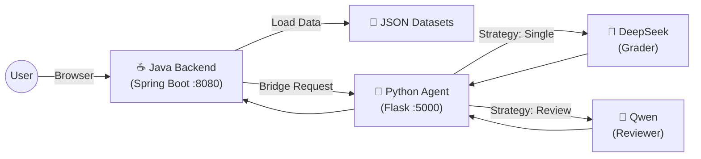

# 🧮 MathGrader: AI-Powered Math Assessment System
> **双模驱动的智能小学数学判卷系统**  
> *基于 Spring Boot Web 后端 + Python AI Agent 微服务架构*

MathGrader 是一个前后端分离的智能教育辅助工具，旨在通过多模型协作（Multi-Model Collaboration）实现高精度的数学主观题自动批改。系统采用 **Java (Web/Data)** 与 **Python (AI/Logic)** 双栈架构，支持本地题库管理、单模速判及双模互评质检。

---

## 🏗️ 核心架构 (Architecture)

系统采用经典的**AI 网关模式**：Java 负责面向用户的业务逻辑，Python 负责面向模型的推理逻辑。



### ☕ Java Backend (Port 8080)
- **角色**: 业务中台 & 静态资源服务器
- **职责**:
  - 托管前端页面 (HTML/JS)
  - 扫描与加载本地题库 (`data/raw/*.json`)
  - 充当 AI 网关，将判卷请求转发给 Python 微服务
- **技术栈**: Spring Boot 3, WebFlux (WebClient), Java NIO

### 🐍 Python Agent (Port 5000)
- **角色**: AI 推理引擎
- **职责**:
  - **Prompt Management**: 提示词版本控制 (`src/prompts/versions/`)
  - **Strategy Dispatch**: 支持单次判卷 / 互评模式切换
  - **LLM Client**: 统一的配置化 LLM 客户端，支持 DeepSeek, Qwen 等
- **技术栈**: Flask, PyYAML, Requests

---

## ✨ 主要功能 (Features)

1.  **📂 本地题库加载**
    - 自动扫描 `data/raw` 目录下的 JSON 文件（如 Math23K, Ape210K）。
    - 支持题目预览、翻页、答案隐藏/显示。

2.  **🤖 智能判卷 (AI Grading)**
    - **单模模式 (Single Pass)**: 快速判断对错，提取分数，生成简短评语。
    - **互评模式 (Peer Review)**:
        - 🕵️ **初审 (Grader)**: 由主模型（如 DeepSeek）进行初步打分。
        - 👮 **复核 (Reviewer)**: 由第二模型（如 Qwen）检查初审结果的公允性，输出最终裁决。

3.  **⚙️ 高度可配置**
    - 通过 `settings.yaml` 热更新模型配置（API Key, Base URL）。
    - 提示词模板化 (`.txt` 文件)，支持快速迭代 Prompt 策略。

---

## 🚀 快速开始 (Quick Start)

### 1. 环境准备
- **Java**: JDK 17+
- **Python**: 3.8+
- **Maven**: 3.6+

### 2. 配置 AI 模型
在项目根目录创建或修改 `settings.yaml`，填入你的 API Key：
```yaml
models:
  deepseek:
    api_key: "sk-your-key"
    base_url: "https://api.deepseek.com/v1"
    model_name: "deepseek-chat"
  qwen:
    api_key: "sk-your-key"
    base_url: "https://dashscope.aliyuncs.com/compatible-mode/v1"
    model_name: "qwen-turbo"

roles:
  grader: "deepseek"   # 初审模型
  reviewer: "qwen"     # 质检模型
```

### 3. 启动服务

**终端 A: 启动 Python Agent**
```bash
pip install -r requirements.txt
python agent_server.py
# Running on http://localhost:5000
```

**终端 B: 启动 Java Backend**
```bash
cd backend_java
mvn spring-boot:run
# Running on http://localhost:8080
```

### 4. 使用
打开浏览器访问 **http://localhost:8080** 即可开始使用。

---

## 📂 目录结构 (Project Structure)

```
MathGrader/
├── agent_server.py       # Python Agent 入口
├── settings.yaml         # 模型配置文件
├── src/                  # Python 核心代码
│   ├── llm_clients/      # 通用 LLM 客户端
│   ├── prompts/          # 提示词模板 (versions/*.txt)
│   └── services/         # 业务逻辑 (Config, Grading Strategies)
├── backend_java/         # Java 后端项目
│   ├── src/main/java/    # Controller, Service, Bridge
│   └── src/main/resources/static/ # 前端静态资源 (index.html)
└── data/                 # 题库数据
```

## 📝 License
MIT License
