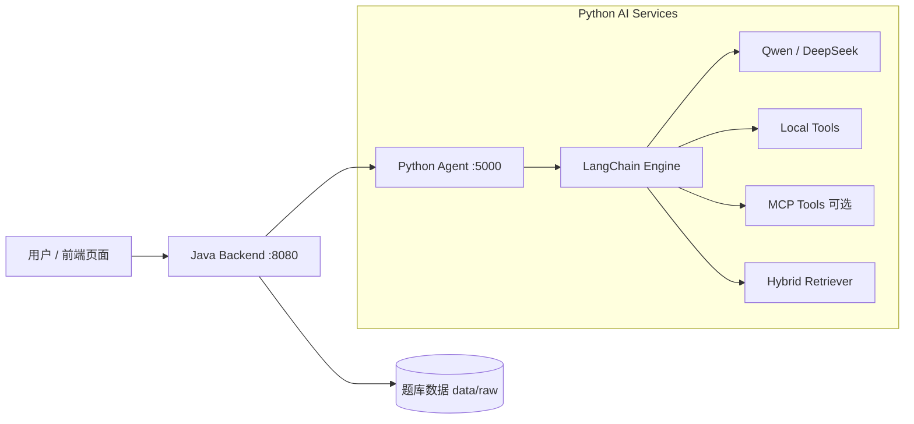
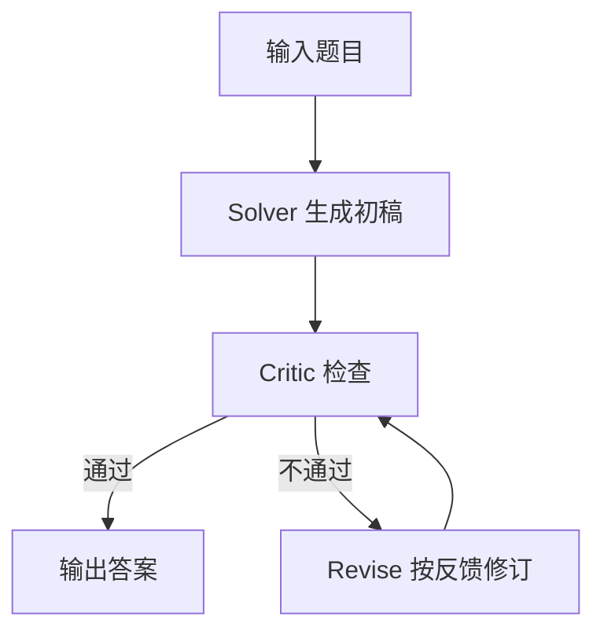
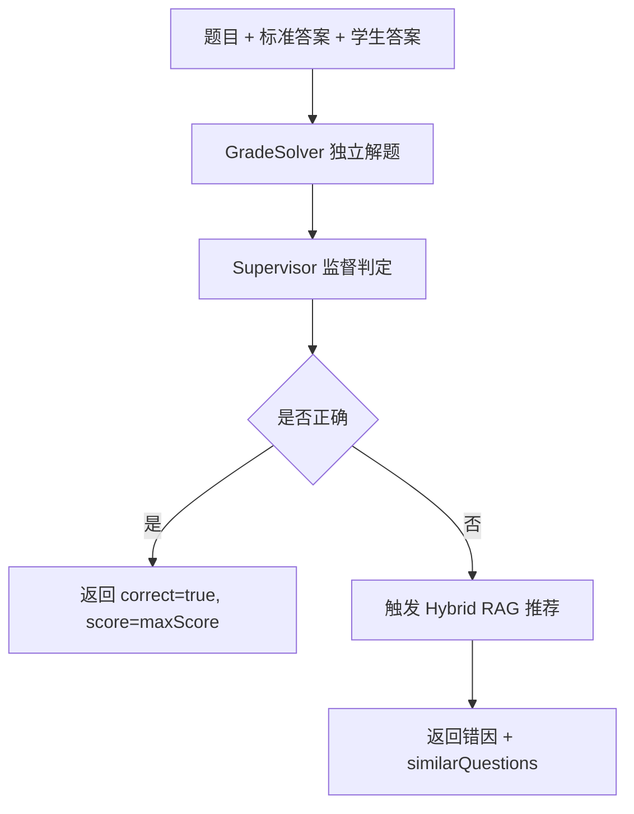
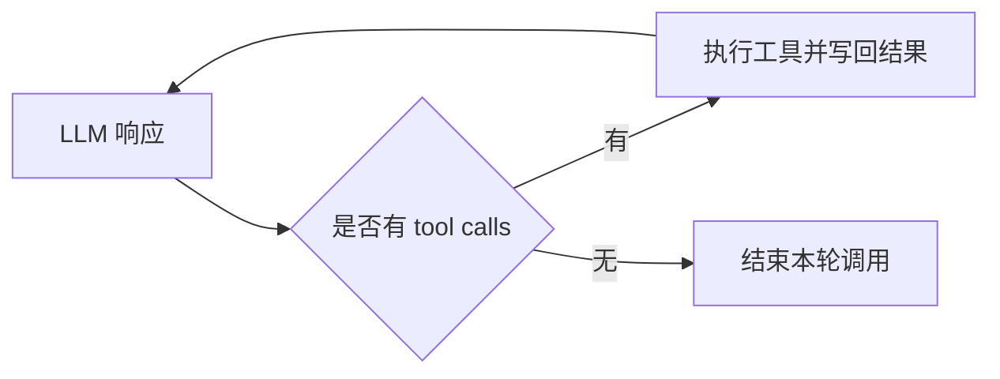
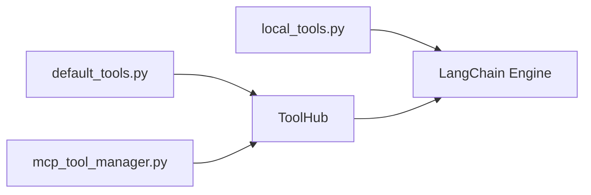
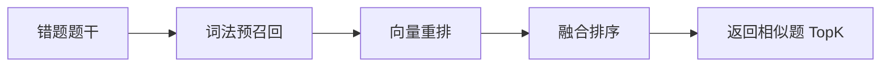

# MathGrader：智能数学解题与判卷系统（LangChain + MCP）

## 1. 项目概览
MathGrader 是一个面向数学题场景的 AI 判卷系统，核心目标是：
- 自动解题
- 自动判卷
- 错题推荐
- 可评测、可迭代优化

当前工程采用 **Java + Python 双服务架构**：
- `backend_java`：页面、用户流程、数据集接口、网关转发
- `agent_server.py`：LangChain Agent 编排、工具调用、判卷与推荐

---

## 2. 核心能力
- **循环解题工作流**：`Solver -> Critic -> Revise` 多轮修正
- **双流程判卷**：一条流程独立做题，一条流程监督判定
- **工具增强推理**：OCR、表达式求值、步骤校验、反例搜索
- **错题推荐（Hybrid RAG）**：词法召回 + 向量重排
- **自动化评测**：一键跑通 `/solve -> /grade`，输出 CSV 与可视化

---

## 3. 系统架构（Architecture）

```mermaid
flowchart LR
    U[用户 / 前端页面] --> J[Java Backend :8080]
    J --> P[Python Agent :5000]

    subgraph PY[Python AI Services]
      P --> E[LangChain Engine]
      E --> LLM1[Qwen / DeepSeek]
      E --> T1[Local Tools]
      E --> T2[MCP Tools 可选]
      E --> R[Hybrid Retriever]
    end

    J --> D[(题库数据 data/raw)]
```

---

## 4. 工作流图解

### 4.1 解题循环（`/solve`）

```mermaid
flowchart TD
    A[输入题目] --> B[Solver 生成初稿]
    B --> C[Critic 检查]
    C -->|通过| D[输出答案]
    C -->|不通过| E[Revise 按反馈修订]
    E --> C
```

说明：
- 模式支持 `single | loop`
- 默认 `loop`，轮数由 `langchain.solve.loop_rounds` 控制

### 4.2 判卷双流程（`/grade`）

```mermaid
flowchart TD
    Q[题目 + 标准答案 + 学生答案] --> S[GradeSolver 独立解题]
    S --> V[Supervisor 监督判定]
    V --> C{是否正确}
    C -->|是| O1[返回 correct=true, score=maxScore]
    C -->|否| R[触发 Hybrid RAG 推荐]
    R --> O2[返回错因 + similarQuestions]
```

说明：
- 这是你的实验基线：**一个流程做题，一个流程判定**

### 4.3 工具调用循环（模型内部）

```mermaid
flowchart LR
    M[LLM 响应] --> T{是否有 tool calls}
    T -->|有| X[执行工具并写回结果]
    X --> M
    T -->|无| Z[结束本轮调用]
```

说明：
- 上限由 `langchain.max_tool_rounds` 控制

---

## 5. 工具体系（Tools）

### 5.1 本地工具
| 工具名 | 作用 | 代码位置 |
|---|---|---|
| `calculate` | 基础计算器 | `src/tools/calculator.py` |
| `ocr_math` | OCR 数学文本识别（PaddleOCR，支持 Mathpix 回退） | `src/langchain_engine/local_tools.py` |
| `img2latex` | 公式图转 LaTeX | `src/langchain_engine/local_tools.py` |
| `eval_expr` | SymPy 表达式求值/化简 | `src/langchain_engine/local_tools.py` |
| `verify_step` | 步骤等式校验 | `src/langchain_engine/local_tools.py` |
| `find_counterexample` | 反例搜索兜底 | `src/langchain_engine/local_tools.py` |

### 5.2 工具注册路径

```mermaid
flowchart LR
    A[default_tools.py] --> B[ToolHub]
    C[local_tools.py] --> D[LangChain Engine]
    B --> D
    E[mcp_tool_manager.py] --> B
```

提示：你在 `src/tools` 里只看到 `calculate` 是正常现象，其他增强工具在 `local_tools.py`。

---

## 6. 错题推荐（Hybrid RAG）

```mermaid
flowchart LR
    A[错题题干] --> B[词法预召回]
    B --> C[向量重排]
    C --> D[融合排序]
    D --> E[返回相似题 TopK]
```

融合公式：
`final_score = (1 - lexical_blend) * vector_score + lexical_blend * lexical_score`

关键实现：
- `src/langchain_engine/retrieval.py`

关键参数：
- `lexical_blend`
- `vector_candidate_k`
- `top_k / recommendation_count`

---

## 7. 配置说明（`settings.yaml`）

重点配置块：
- `mcp`: MCP 服务列表、刷新频率
- `langchain`: Agent 编排总配置
- `langchain.solve`: 解题模型、循环轮数、工具列表
- `langchain.grade`: 做题模型 + 监督模型
- `langchain.recommendation`: 混合检索参数

示例（节选）：
```yaml
langchain:
  max_tool_rounds: 4
  solve_mode: "loop"

  solve:
    solver_model: "qwen"
    critic_model: "deepseek"
    loop_rounds: 2

  grade:
    solver_model: "qwen"
    supervisor_model: "deepseek"

  recommendation:
    lexical_blend: 0.35
    vector_candidate_k: 80
```

---

## 8. API 总览

### 8.1 Python Agent
- `GET /models`
- `GET /grading-methods`
- `POST /ocr`
- `POST /solve`
- `POST /grade`

### 8.2 Java 网关（常用）
- `GET /api/agent/history`：查询提交历史
- `DELETE /api/agent/history`：清空提交历史（管理员清全部，普通用户清自己）

---

## 9. 快速启动

### 9.1 Python Agent
```bash
pip install -r requirements.txt
python agent_server.py
```
默认地址：`http://localhost:5000`

### 9.2 Java Backend
```bash
cd backend_java
mvn spring-boot:run
```
默认地址：`http://localhost:8080`

---

## 10. 自动化评测

```mermaid
flowchart LR
    A[读取题目] --> B[调用 /solve]
    B --> C[调用 /grade]
    C --> D[汇总准确率/时延]
    D --> E[导出 CSV + 图表]
```

脚本位置：
- `src/evaluation/run_eval.py`
- `src/evaluation/plot_results.py`

---

## 11. 目录结构
```text
agent_server.py
settings.yaml
settings.example.yaml
requirements.txt
src/
  langchain_engine/
    engine.py
    local_tools.py
    retrieval.py
  prompts/versions/
    v2_lc_*.txt
  llm_clients/
    base_client.py
  tools/
    calculator.py
    default_tools.py
    tool_hub.py
    mcp_tool_manager.py
  services/
    config_service.py
    ocr_service.py
    prompt_service.py
  evaluation/
    run_eval.py
    plot_results.py
backend_java/
```

---

## 12. 说明
- 未安装 `langchain` 时，会回退到兼容调用路径（`LLMClient`）
- `pix2tex`、`Mathpix` 为可选依赖
- MCP 工具需要在 `settings.yaml` 的 `mcp.servers` 中启用
