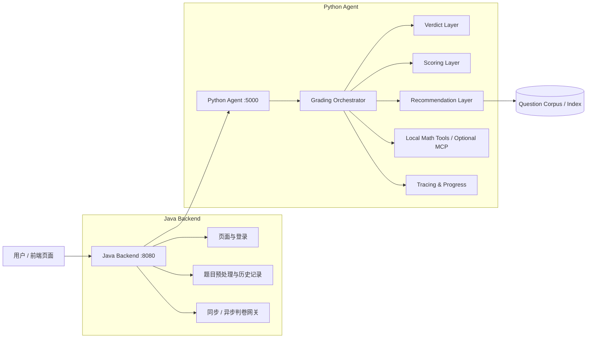
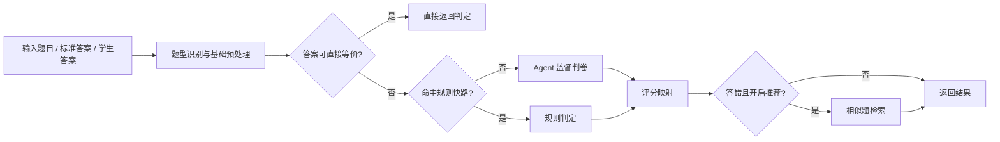

# MathGrader：智能数学解题与判卷系统（LangChain + MCP）

## 1. 项目概览
MathGrader 是一个面向数学题场景的 AI 解题与判卷系统。项目目标不是只返回一个“对/错”，而是把判卷过程拆解成可解释、可追踪、可扩展的链路：
- 能独立完成解题与判卷
- 能区分规则直判与复杂题监督判定
- 能根据题型映射不同评分策略
- 能在需要时返回相似题推荐
- 能输出阶段进度、评分依据与性能信息，便于调试与优化

当前工程采用 **Java + Python 双服务架构**：
- `backend_java`：页面、登录、历史记录、题目预处理、同步/异步请求转发
- `agent_server.py`：Agent 编排、判卷链路、评分映射、推荐检索、运行时 trace

---

## 2. 当前项目逻辑
这个项目现在的核心已经不只是“Solver + Supervisor”。

更准确地说，`/grade` 走的是一条分层判卷链路：
- 先做题目预处理和题型识别
- 先尝试答案等价比对
- 对选择、判断、简单计算题优先走规则快路，减少延迟
- 对复杂题再进入 Agent 主链路，由模型结合标准答案、学生答案和结构化证据完成判定
- 判定完成后再进入评分层，按题型选择 `binary / analytic / none`
- 仅当学生答错且开启推荐时，触发相似题检索
- 最后把阶段摘要、trace、耗时与评分结果一起返回

这意味着项目现在更偏向一个 **“可解释的判卷编排器”**，而不是单一的大模型问答接口。

---

## 3. 系统架构（Architecture）

```mermaid
flowchart LR
    U[用户 / 前端页面] --> J[Java Backend :8080]
    J --> P[Python Agent :5000]

    subgraph JAVA[Java Backend]
      J --> J1[页面与登录]
      J --> J2[题目预处理与历史记录]
      J --> J3[同步 / 异步判卷网关]
    end

    subgraph PY[Python Agent]
      P --> E[Grading Orchestrator]
      E --> V[Verdict Layer]
      E --> S[Scoring Layer]
      E --> R[Recommendation Layer]
      E --> T[Local Math Tools / Optional MCP]
      E --> O[Tracing & Progress]
    end

    R --> D[(Question Corpus / Index)]
```

---

## 4. 判卷主流程

```mermaid
flowchart LR
    A[输入题目 / 标准答案 / 学生答案] --> B[题型识别与基础预处理]
    B --> C{答案可直接等价?}
    C -->|是| D[直接返回判定]
    C -->|否| E{命中规则快路?}
    E -->|是| F[规则判定]
    E -->|否| G[Agent 监督判卷]
    G --> H[评分映射]
    F --> H
    H --> I{答错且开启推荐?}
    I -->|是| J[相似题检索]
    I -->|否| K[返回结果]
    J --> K
```

补充说明：
- 若标准答案已足够使用，链路会跳过不必要的求解步骤，降低时延
- 对公式化、方程式作答，会补充结构化验证证据，增强监督判卷稳定性
- `/grade/submit` 会把同一条判卷链路放到后台线程执行，并通过 job 进度持续返回阶段状态

---

## 5. 当前链路优化点
项目最近一轮重点不在“堆更多能力”，而在 **让判卷链路更稳、更快、更可控**：
- 增加规则快路，减少简单题进入大模型主链路的次数
- 将判定与评分分层，避免“对错判断”和“得分映射”耦合
- 推荐检索改成按需触发，只在答错且显式开启时生效
- MCP 从主流程依赖改为可选扩展，不再默认影响普通判卷路径
- 异步判卷支持阶段进度与耗时追踪，便于观察瓶颈
- 强化监督判卷 prompt 约束，降低不同模型之间的判卷漂移

---

## 6. 核心能力
- **分层判卷**：规则快路与 Agent 主链路并存，兼顾效率与复杂题处理能力
- **可解释结果**：返回判定结论、评分摘要、阶段摘要与性能信息
- **评分策略分层**：按题型自动选择不同评分模式，支持关闭分数只做判定
- **按需推荐**：错误答案场景下返回相似题，使用 Weaviate 混合检索返回候选结果
- **异步任务化**：长链路判卷可异步执行，并持续查询进度
- **可观测性**：支持 trace、阶段 timing、模型信息、检索摘要等调试信息

---

## 7. MCP 与 RAG 的当前定位
这两个能力都还保留，但角色已经和早期版本不同：

### MCP
- 现在更偏向 **可选外部扩展层**
- 适合接外部规则解析、业务工具、文件系统等能力
- 普通判卷主链路默认不依赖 MCP 才能完成

### RAG / 推荐检索
- 现在更偏向 **错误场景下的教学辅助能力**
- 只在答错且开启推荐时触发
- 检索策略采用 **BM25 + 向量检索** 的混合思路，兼顾可解释性与召回质量
- 当前推荐层统一基于 `Weaviate` 落地，围绕混合检索与索引导入做工程化封装

换句话说，MCP 和 RAG 现在都不是“每次都必须参与的主路径”，而是围绕主判卷链路的增强层。

---

## 8. API 概览

### 8.1 Python Agent
- `POST /ocr`
- `POST /solve`
- `POST /grade`
- `POST /grade/submit`
- `GET /grade/jobs/<job_id>`

### 8.2 Java 网关
- `POST /api/agent/ocr`
- `POST /api/agent/solve`
- `POST /api/agent/grade`
- `POST /api/agent/grade/submit`
- `GET /api/agent/grade/progress/{jobId}`
- `GET /api/agent/history`
- `DELETE /api/agent/history`

前端通常优先通过 Java 网关访问系统，而不是直接调用 Python 服务。

---

## 9. 配置说明（`settings.yaml`）
项目启动时默认读取根目录的 `settings.yaml`。如果不存在，可从示例文件复制：

```bash
copy settings.example.yaml settings.yaml
```

重点配置块：
- `models`：模型别名、API Key、Base URL、模型名
- `roles`：默认角色到模型的映射
- `mcp`：可选 MCP 服务列表与刷新配置
- `langchain.solve`：解题模型、轮数与工具开关
- `langchain.grade`：判卷模型、评分策略、工具与扩展能力开关
- `langchain.recommendation`：推荐检索开关、数据目录与 Weaviate 检索配置
- `trace`：是否输出运行时 trace

---

## 10. 快速启动

### 10.1 Python Agent
```bash
pip install -r requirements.txt
python agent_server.py
```
默认地址：`http://localhost:5000`

### 10.2 Java Backend
```bash
cd backend_java
mvn spring-boot:run
```
默认地址：`http://localhost:8080`

### 10.3 可选：启动 MCP 扩展
```powershell
powershell -ExecutionPolicy Bypass -File .\scripts\start_filesystem_mcp.ps1
```

---

## 11. 评测与实验
项目仍保留批量评测脚本，主要用于对比不同模型、策略和链路时延：
- `src/evaluation/run_eval.py`
- `src/evaluation/plot_results.py`

这部分更适合做实验与回归检查，不是主业务链路的一部分。

---

## 12. 目录结构
```text
agent_server.py
settings.yaml
settings.example.yaml
requirements.txt
rubrics/
scripts/
src/
  grading/
  langchain_engine/
  prompts/
  tools/
  services/
  evaluation/
backend_java/
```

---

## 13. 说明
- 当部分依赖不可用时，系统会回退到兼容调用路径，保证主流程可运行
- OCR、推荐检索、MCP 都属于可按场景启停的能力层，不要求所有部署都全部启用
- README 主要描述系统结构与工程思路，具体策略与业务细节以代码实现为准
