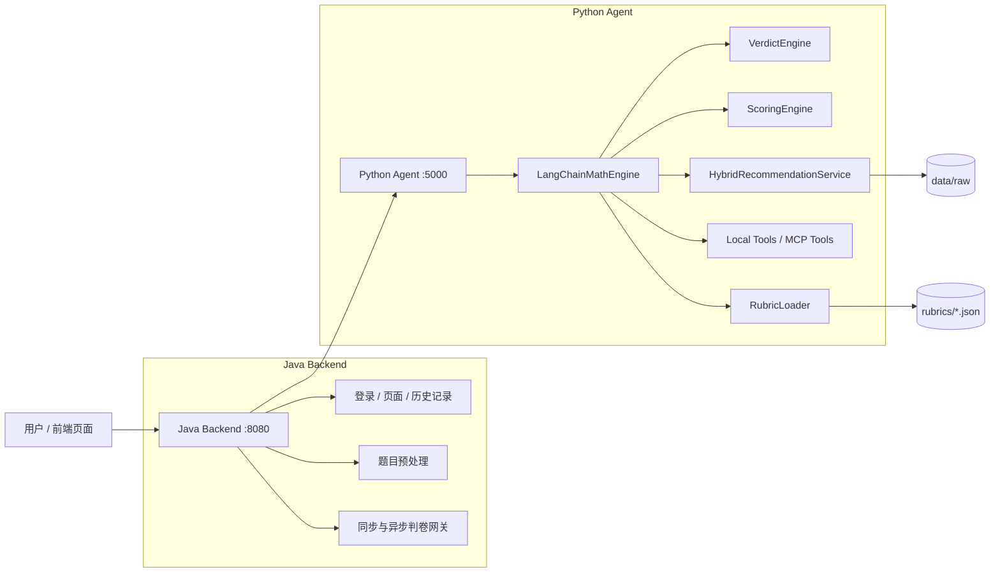
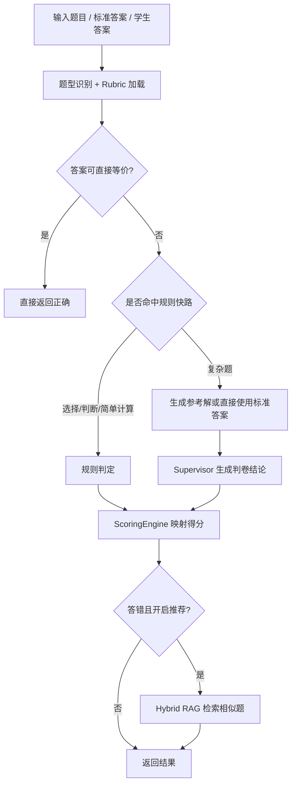

# MathGrader：智能数学解题与判卷系统（LangChain + MCP）

## 1. 项目概览
MathGrader 是一个面向数学题场景的 AI 解题与判卷系统，目标不是只给出一个“对/错”结果，而是尽量把判卷过程拆开做清楚：
- 能独立解题
- 能判断学生答案是否正确
- 能按题型映射得分
- 能在答错时返回相似题推荐
- 能输出阶段进度、评分依据与性能信息，方便调试和迭代

当前工程采用 **Java + Python 双服务架构**：
- `backend_java`：页面、登录、历史记录、题目预处理、同步/异步请求转发
- `agent_server.py`：LangChain Agent 编排、规则快路、监督判定、评分映射、推荐检索

---

## 2. 当前项目逻辑
这个项目现在的核心已经不只是“Solver + Supervisor”。

更准确地说，`/grade` 走的是一条分层判卷链路：
- 先做题目预处理和题型识别
- 先尝试答案等价比对
- 对选择、判断、简单计算题优先走规则快路，减少延迟
- 对复杂题再进入 `Solver / Supervisor` 判卷链路
- 判定完成后再进入 `ScoringEngine`，按题型选择 `binary / analytic / none`
- 仅当学生答错且开启推荐时，触发 Hybrid RAG 返回相似题
- 最后把阶段摘要、trace、工具调用和耗时一起返回

这意味着项目现在更偏向一个 **“可解释的判卷编排器”**，而不是单一的大模型问答接口。

---

## 3. 系统架构（Architecture）

```mermaid
flowchart LR
    U[用户 / 前端页面] --> J[Java Backend :8080]
    J --> P[Python Agent :5000]

    subgraph JAVA[Java Backend]
      J --> J1[登录 / 页面 / 历史记录]
      J --> J2[题目预处理]
      J --> J3[同步与异步判卷网关]
    end

    subgraph PY[Python Agent]
      P --> E[LangChainMathEngine]
      E --> V[VerdictEngine]
      E --> S[ScoringEngine]
      E --> R[HybridRecommendationService]
      E --> T[Local Tools / MCP Tools]
      E --> RB[RubricLoader]
    end

    R --> D[(data/raw)]
    RB --> RU[(rubrics/*.json)]
```

---

## 4. 判卷主流程

```mermaid
flowchart TD
    A[输入题目 / 标准答案 / 学生答案] --> B[题型识别 + Rubric 加载]
    B --> C{答案可直接等价?}
    C -->|是| D[直接返回正确]
    C -->|否| E{是否命中规则快路}
    E -->|选择/判断/简单计算| F[规则判定]
    E -->|复杂题| G[生成参考解或直接使用标准答案]
    G --> H[Supervisor 生成判卷结论]
    F --> I[ScoringEngine 映射得分]
    H --> I
    I --> J{答错且开启推荐?}
    J -->|是| K[Hybrid RAG 检索相似题]
    J -->|否| L[返回结果]
    K --> L
```

补充说明：
- 若标准答案已可直接使用，可跳过独立求解，减少一次模型调用
- 对方程式作答会额外做 `equation_validation`，并限制监督阶段可用工具范围
- `/grade/submit` 会把同一条链路放到后台线程执行，并通过 `/grade/jobs/<jobId>` 持续返回阶段进度

---

## 5. 核心能力
- **循环解题工作流**：`/solve` 支持 `single | loop`，默认是 `Solver -> Critic -> Revise`
- **规则快路判卷**：选择题、判断题、简单计算题优先直接判定，优先优化响应时间
- **监督式复杂题判卷**：复杂题保留 `reference_answer + supervisor_verdict` 的双层结构
- **显式评分逻辑**：评分从判错/判对中拆出，支持 `auto / binary / analytic / none`
- **Rubric 驱动评分**：评分规则从 `rubrics/*.json` 加载，而不是硬编码在 prompt 里
- **工具增强推理**：本地工具与 MCP 工具统一纳入 Agent 调度
- **错题推荐**：仅在答错时触发 Hybrid RAG，减少无效检索
- **过程可追踪**：结果中带有 `progress_summary`、`perf`、`trace_id`、工具调用摘要

---

## 6. 评分与 Rubric
当前评分逻辑分两层：
- `VerdictEngine` 负责“是否正确”以及判卷依据
- `ScoringEngine` 负责“如何映射成分数”

默认策略：
- `choice / judgment / arithmetic`：走 `binary`
- 其他复杂题：走 `analytic`
- 若请求里关闭 `need_score`：走 `none`

Rubric 文件：
- `rubrics/binary.json`：客观题与简单计算题
- `rubrics/default.json`：复杂题分析式评分

复杂题默认关注三个维度：
- 解题思路
- 关键步骤
- 最终结论

这部分是现在项目逻辑里最重要的更新之一：判卷与评分已经分层，后续无论接 MCP 评分分析还是业务化评分细则，入口都比较稳定。

---

## 7. 工具体系
本地工具主要在 `src/langchain_engine/local_tools.py`：
- `ocr_math`
- `img2latex`
- `eval_expr`
- `verify_step`
- `verify_equation_setup`
- `find_counterexample`

基础计算器和工具路由在：
- `src/tools/calculator.py`
- `src/tools/tool_hub.py`
- `src/tools/mcp_tool_manager.py`

MCP 当前已经预留为正式能力，而不是实验性附加项。默认配置里给了 `filesystem` MCP 的接入方式，对应脚本：
- `scripts/start_filesystem_mcp.ps1`

---

## 8. API 总览

### 8.1 Python Agent
- `GET /models`
- `GET /grading-methods`
- `POST /ocr`
- `POST /solve`
- `POST /grade`
- `POST /grade/submit`
- `GET /grade/jobs/<job_id>`

### 8.2 Java 网关
- `POST /api/agent/ocr`
- `POST /api/agent/solve`
- `POST /api/agent/grade`
- `POST /api/agent/grade/submit`
- `GET /api/agent/grade/progress/{jobId}`
- `GET /api/agent/history`
- `DELETE /api/agent/history`

如果你从前端视角使用系统，通常应优先走 Java 网关，而不是直接调用 Python 服务。

---

## 9. 配置说明（`settings.yaml`）
项目启动时默认读取根目录的 `settings.yaml`。如果不存在，会退回非常有限的默认配置，因此实际运行建议从示例文件复制：

```bash
copy settings.example.yaml settings.yaml
```

重点配置块：
- `models`：大模型别名、API Key、Base URL、模型名
- `roles`：默认角色到模型的映射
- `mcp`：MCP 服务列表与刷新配置
- `langchain.solve`：解题模型、循环轮数、工具列表
- `langchain.grade`：判卷模型、是否跳过 solver、评分分析工具配置
- `langchain.recommendation`：推荐开关、数据根目录、混合检索参数
- `trace`：是否输出 trace 日志

---

## 10. 快速启动

### 10.1 Python Agent
```bash
pip install -r requirements.txt
python agent_server.py
```
默认地址：`http://localhost:5000`

### 10.2 Java Backend
```bash
cd backend_java
mvn spring-boot:run
```
默认地址：`http://localhost:8080`

### 10.3 可选：启动 Filesystem MCP
```powershell
powershell -ExecutionPolicy Bypass -File .\scripts\start_filesystem_mcp.ps1
```

---

## 11. 自动化评测
评测脚本仍然保留，主要用于批量跑通 `solve -> grade`：
- `src/evaluation/run_eval.py`
- `src/evaluation/plot_results.py`

它更适合做实验对比和延迟统计，不是系统主流程本身。

---

## 12. 目录结构
```text
agent_server.py
settings.yaml
settings.example.yaml
requirements.txt
rubrics/
  binary.json
  default.json
scripts/
  start_filesystem_mcp.ps1
src/
  grading/
    verdict_engine.py
    scoring_engine.py
    rubric_loader.py
    mcp_scoring_analyzer.py
    grade_job_store.py
  langchain_engine/
    engine.py
    local_tools.py
    retrieval.py
    grading_support.py
    grading_results.py
  prompts/versions/
    v2_lc_*.txt
  tools/
    calculator.py
    tool_hub.py
    mcp_tool_manager.py
  services/
    config_service.py
    ocr_service.py
    prompt_service.py
  evaluation/
    run_eval.py
    plot_results.py
backend_java/
```

---

## 13. 说明
- 未安装 `langchain` 时，会回退到兼容调用路径 `LLMClient`
- `pix2tex`、`Mathpix` 属于可选能力
- 推荐检索依赖 `data/raw` 下的数据集
- 当前 README 只保留了两张框图：一张讲系统结构，一张讲判卷主流程，其他细节尽量并入文字，避免图多但逻辑反而被拆散
