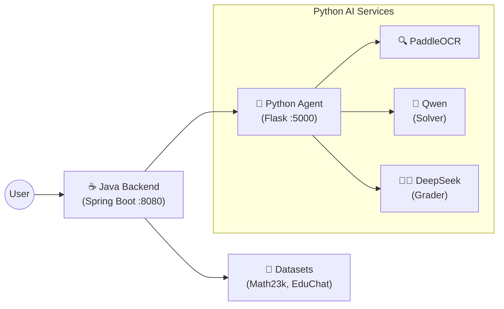

# 🧮 MathGrader: AI-Powered Math Assessment System
> **双模驱动的智能小学数学判卷与解题系统**  
> *Spring Boot (Java) + Flask (Python) + Vue.js + LLM Agents*

MathGrader 是一个全栈式的智能教育辅助平台，融合了 **OCR 视觉识别**、**LLM 逻辑推理** 和 **自动化评估** 技术。它不仅支持对现有题库的自动批改，还支持**拍照搜题**、**AI 自动解题**以及**自定义题目生成**。

---

## ✨ 核心功能 (Key Features)

### 1. 📸 拍照搜题 & OCR (Photo Search)
- **多模态输入**: 支持上传数学题目图片。
- **智能识别**: 集成 **PaddleOCR** (自动回退机制)，精准识别印刷体与手写体数学公式。
- **即时编辑**: 识别结果可直接在前端编辑修正。

### 2. ✍️ 自定义题目 & AI 解题 (Custom & AI Solver)
- **自定义模式**: 用户可手动输入或通过 OCR 导入新题目。
- **AI 自动解题**: 内置 **Solver Agent** (默认 Qwen-Turbo)，一键生成标准答案与解题步骤。
- **所见即所得**: 支持 MathJax 实时渲染 LaTeX 数学公式。

### 3. 🤖 智能判卷 (AI Grading)
- **双模互评架构**:
    - **Solver (学生角色)**: 负责解题 (默认 Qwen)。
    - **Grader (老师角色)**: 负责判卷 (默认 DeepSeek)。
- **多维度评分**: 提供分数、判定结果（对/错）以及详细的评语分析。

### 4. 📚 多维题库管理 (Dataset Management)
- **多格式支持**: 兼容 `.json` (Math23k) 和 `.jsonl` (EduChat) 格式。
- **智能筛选**: 支持按 **年级/等级 (Level)** 筛选题目（如“高二”、“三年级”）。
- **高性能列表**: 采用前端分页渲染，轻松支撑数万条题目的流畅浏览。

### 5. 📊 自动化评估体系 (Auto-Evaluation)
- **端到端测试**: 提供 `run_eval.py` 脚本，自动化运行 "题目 -> AI 解题 -> AI 判卷" 流程。
- **可视化报告**: 自动生成准确率饼图、响应延迟直方图及 CSV 详细分析报告。

---

## 🏗️ 系统架构 (Architecture)

系统采用 **AI Gateway** 模式，Java 负责业务编排，Python 负责 AI 算力供给。


```mermaid
graph LR
    User((User)) --> Java["☕ Java Backend\n(Spring Boot :8080)"]
    Java --> FS["📂 Datasets\n(Math23k, EduChat)"]
    Java --> Python["🐍 Python Agent\n(Flask :5000)"]
    
    subgraph "Python AI Services"
        Python --> Paddle["🔍 PaddleOCR"]
        Python --> LLM1["🧠 Qwen\n(Solver)"]
        Python --> LLM2["👨‍🏫 DeepSeek\n(Grader)"]
    end
```

### ☕ Java Backend (Port 8080)
- **角色**: 业务中台 & 静态资源服务器
- **职责**:
  - 托管前端页面 (HTML/JS)
  - 扫描与加载本地题库 (`data/raw/*.json`)
  - 充当 AI 网关，将判卷请求转发给 Python 微服务
- **技术栈**: Spring Boot 3, WebFlux (WebClient), Java NIO

### 🐍 Python Agent (Port 5000)
- **角色**: AI 推理引擎
- **职责**:
  - **Prompt Management**: 提示词版本控制 (`src/prompts/versions/`)
  - **Strategy Dispatch**: 支持单次判卷 / 互评模式切换
  - **LLM Client**: 统一的配置化 LLM 客户端，支持 DeepSeek, Qwen 等
- **技术栈**: Flask, PyYAML, Requests

---

## ✨ 主要功能 (Features)

1.  **📂 本地题库加载**
    - 自动扫描 `data/raw` 目录下的 JSON 文件（如 Math23K, Ape210K）。
    - 支持题目预览、翻页、答案隐藏/显示。

2.  **🤖 智能判卷 (AI Grading)**
    - **单模模式 (Single Pass)**: 快速判断对错，提取分数，生成简短评语。
    - **互评实验模式 (Peer Review)**:
        - 🕵️ **初审 (Grader)**: 由主模型（如 DeepSeek）进行答题。
        - 👮 **复核 (Reviewer)**: 由第二模型（如 Qwen）检查主模型答题质量进行实验评判。

3.  **⚙️ 高度可配置**
    - 通过 `settings.yaml` 热更新模型配置（API Key, Base URL）。
    - 提示词模板化 (`.txt` 文件)，支持快速迭代 Prompt 策略。
---

## 🚀 快速开始 (Quick Start)

### 1. 环境准备
- **Java**: JDK 17+ (Maven)
- **Python**: 3.8+
- **API Key**: 阿里云 DashScope (Qwen), DeepSeek API

### 2. 配置 AI 模型
在项目根目录修改 `settings.yaml`。**注意：Qwen 需使用国际版 URL 以避免 401 错误。**

```yaml
models:
  deepseek:
    api_key: "sk-your-deepseek-key"
    base_url: "https://api.deepseek.com"
    model_name: "deepseek-chat"
  qwen:
    api_key: "sk-your-qwen-key"
    base_url: "https://dashscope-intl.aliyuncs.com/compatible-mode/v1" # 国际版地址
    model_name: "qwen-turbo"

roles:
  solver: "qwen"       # 解题模型
  grader: "deepseek"   # 判卷模型
  
ocr:
  paddle:
    enable: true       # 启用 PaddleOCR 回退
```

### 3. 启动服务

**步骤 A: 启动 Python Agent (AI 服务)**
```bash
pip install -r requirements.txt
python agent_server.py
# 服务启动于 http://localhost:5000
```

**步骤 B: 启动 Java Backend (Web 服务)**
```bash
cd backend_java
mvn spring-boot:run
# 服务启动于 http://localhost:8080
```

### 4. 访问应用
打开浏览器访问 **http://localhost:8080**。

---

## 🧪 运行评估测试 (Run Evaluation)

如果您想测试当前模型组合在特定数据集上的表现（准确率、耗时），可运行评估脚本：

```bash
# 运行前 50 道题的测试
python src/evaluation/run_eval.py --data data/raw/math23k/math23k_test.json --limit 50
```

测试完成后，结果将保存在 `results/` 目录下，包含：
- `eval_*.csv`: 详细的题目、模型回答、判卷结果列表。
- `eval_*.png`: 准确率统计图表。

---

## 📂 目录结构 (Project Structure)

```
MathGrader/
├── agent_server.py           # Python Agent 入口 (Flask)
├── settings.yaml             # 核心配置文件 (API Keys, Roles)
├── requirements.txt          # Python 依赖
├── src/                      # Python 核心代码
│   ├── evaluation/           # 评估脚本 (run_eval.py, plot_results.py)
│   ├── llm_clients/          # LLM 客户端封装
│   ├── prompts/              # 提示词模板 (Solver/Reviewer)
│   └── services/             # 业务逻辑 (OCR, Grading, Config)
├── backend_java/             # Java 后端项目
│   ├── src/main/java/        # Controller, Service
│   └── src/main/resources/   # 静态资源 (HTML, CSS, JS)
├── data/                     # 题库数据 (Math23k, EduChat)
└── results/                  # 评估结果输出目录
```

## 📝 License
MIT License
